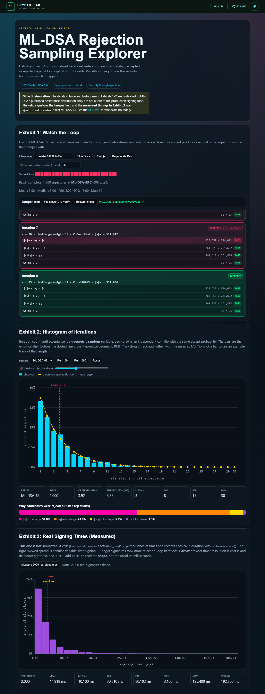
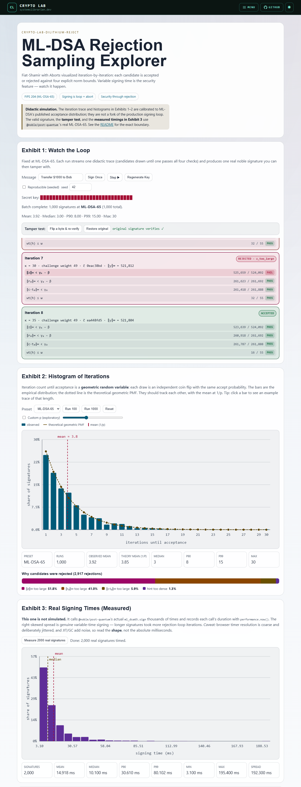

# crypto-lab-dilithium-reject

Browser-based explainer for ML-DSA rejection sampling: the Fiat-Shamir with Aborts loop that makes lattice signatures secure.

[](https://github.com/systemslibrarian/crypto-lab-dilithium-reject/actions/workflows/ci.yml)

[**Live demo →**](https://systemslibrarian.github.io/crypto-lab-dilithium-reject/)



<details>
<summary>Light theme</summary>



</details>

> "Whether therefore ye eat, or drink, or whatsoever ye do, do all to the glory of God."
> 1 Corinthians 10:31

## What It Is

This project visualizes the signing rejection loop used by ML-DSA (FIPS 204, August 2024). It walks through what happens iteration by iteration: a candidate is drawn, four norm-bound checks are applied, and either the candidate is accepted or one specific check fails and the loop retries.

The demo targets ML-DSA-65 (NIST level 3) by default and uses strict TypeScript with a browser-only stack (Vite + vanilla CSS, no backend).

Heavy batches and the real-timing measurement run in a **Web Worker** so the UI stays smooth.

Highlights — **didactic simulation** (calibrated, see [the boundary](#how-this-demo-works-important)):

- **Streamed iteration feed** that reveals candidates one-by-one, each with four labelled PASS/FAIL norm checks (`‖z‖∞`, `‖r₀‖∞`, `‖c·t₀‖∞`, `wt(h)`) and the explicit rejection reason — plus a **step-through mode** to advance one iteration at a time
- **SVG histogram** of iterations-until-acceptance with a theoretical geometric-distribution overlay and a `mean = 1/p` marker, per preset. An **exploratory `p` slider** lets you drag the acceptance probability and watch the geometric curve and mean move; **click any bar** to replay an example trace of that length
- **Rejection-reason breakdown bar** showing the published mix (z dominates, r0 next, ct0 and hint rare)
- **KS distinguishability test** that overlays two empirical CDFs and marks the max gap, illustrating sk-independent timing
- **Reproducible (seeded) mode** so a trace and its signature can be reproduced exactly — the idea behind FIPS 204 deterministic signing

Highlights — **real cryptography** (via [`@noble/post-quantum`](https://www.npmjs.com/package/@noble/post-quantum)):

- **Exhibit 3 measures real signing times**: it calls the actual `ml_dsa65.sign` thousands of times and plots the genuine, right-skewed wall-clock distribution (with an honest caveat about timer resolution)
- **Tamper test**: flip one bit of a produced signature and watch real `ml_dsa65.verify` reject it
- The "valid" signature in Exhibit 1 is produced and verified by the real library

Plus: comparison table across Ed25519/ECDSA/ML-DSA/SLH-DSA/FALCON/LMS, an exhibit explaining why each check exists in FIPS 204, a symbols glossary with further-reading links, dark/light themes (AA/AAA contrast), keyboard + screen-reader support (verified by an axe-core test), and `prefers-reduced-motion` handling.

## How This Demo Works (Important)

The iteration feed in Exhibit 1 and the histogram in Exhibit 2 are a **didactic simulation calibrated to ML-DSA's published acceptance distribution**, not a fork of the real signing internals.

- Acceptance per iteration is a coin flip with `p(accept)` set per preset (~0.31 for ML-DSA-44, ~0.26 for ML-DSA-65, ~0.22 for ML-DSA-87). These are **illustrative values calibrated to the order-of-magnitude reported by published ML-DSA implementations**; treat them as the right shape of the distribution, not as measurements. The calibration is asserted by `src/instrumented-sign.test.ts`, which fails the build if mean iterations drift more than ±15% from `1/acceptance`.
- Because each iteration is an _independent_ coin flip, the number of iterations until acceptance is **geometrically distributed**. Exhibit 2 overlays that theoretical geometric PMF (and the `mean = 1/p` marker) on the observed bars so you can see the simulation match the model — and so the same independence is what makes timing sk-independent in the real scheme.
- When a candidate is rejected, the specific reason is sampled from the published mix (z dominates, r0 next, ct0 and hint rare). The displayed `||z||∞`, `||r0||∞`, `||c·t0||∞` values are positioned above/below their thresholds to be consistent with that reason; they are not computed from a live `y + c·s1` etc.
- The actual signature shown as "valid" is produced by [`@noble/post-quantum`](https://www.npmjs.com/package/@noble/post-quantum)'s real ML-DSA implementation. The verification check uses the same library. That part is real.
- **Exhibit 3 is real, not simulated.** It times thousands of actual `ml_dsa65.sign` calls with `performance.now()` and plots the genuine distribution. The variability is real variable-time signing; the caveat is that browser timer resolution is coarse/jittered and JIT/GC add noise, so it's faithful in shape, not in absolute milliseconds. The **tamper test** also uses the real library: a flipped bit makes `ml_dsa65.verify` return false.
- `src/mldsa-primitives.ts` contains real implementations of `infinityNorm`, `highBits`/`lowBits`, `hintWeight`, and a SampleInBall variant; it is wired into the demo for the per-check explanation exhibit but does not drive the iteration feed.

This separation is deliberate: instrumenting `@noble/post-quantum`'s signing loop from outside the library would require patching internals, while the goal here is pedagogical clarity. The simulation is faithful to the _shape_ and _reasons_ — not the bit-exact arithmetic — of FIPS 204 § 6.

If you need bit-exact internal traces of real ML-DSA signing, use a reference implementation that exposes per-iteration hooks (e.g. NIST's C reference) rather than this demo.

## When to Use It

Use this demo when you need to:

- teach why ML-DSA signing time is variable by design
- explain Fiat-Shamir with Aborts in lattice signatures
- show that rejection is a security feature, not an implementation bug
- discuss timing side-channel risk tradeoffs in post-quantum signatures
- compare ML-DSA timing behavior with other signature families

Do not use this project as production signing code. For production, use maintained, hardened libraries and platform-specific side-channel countermeasures.

## Install and Run

```bash
npm install
npm run dev          # local dev server with hot reload
npm run build        # type-check + production build to ./dist
npm run preview      # serve the built bundle
npm test             # unit tests (vitest)
npm run lint         # eslint (typescript-eslint)
npm run format       # prettier --check
```

Requires Node 22+. The build is a static bundle; the GitHub Pages workflow (`.github/workflows/deploy.yml`) publishes `./dist` to `gh-pages` on each push to `main`, and `.github/workflows/ci.yml` lints, checks formatting, type-checks, builds, and tests every pull request.

## Testing

```bash
npm test
```

- `src/distributions.test.ts` — the pure math behind the charts (geometric PMF/CDF/mean, histogram bucketing, continuous binning, empirical CDF, quantiles, KS max-gap).
- `src/instrumented-sign.test.ts` — **calibration gate**: fails the build if mean iterations drift more than ±15% from `1/acceptance`, plus the rejection-reason mix, the exploratory acceptance override, exact-length traces, and that the returned signature verifies under real noble ML-DSA-65.
- `src/mldsa-primitives.test.ts` — `infinityNorm`, `highBits`/`lowBits` round-trip, `SampleInBall`, `expandMask` ranges, `hintWeight`, and the seedable RNG (same seed ⇒ identical trace).
- `src/real-timing.test.ts` — the real `ml_dsa65.sign` timing harness returns one non-negative duration per signature.
- `src/timing-analysis.test.ts` — the KS distinguishability verdict.
- `src/app.dom.test.ts` — renders the whole app in jsdom and asserts there are **no serious/critical accessibility violations** (axe-core), plus that every primary control is wired.

## Live Demo

https://systemslibrarian.github.io/crypto-lab-dilithium-reject/

## What Can Go Wrong (in real deployments)

- Variable signing time can become a side-channel if deployment hardening is weak.
- Worst-case retries matter operationally; FIPS 204 permits bounded loops with failure return.
- Rejection-loop timing is not the only leak source; arithmetic and memory access patterns also matter.
- Deterministic mode has reproducibility benefits but different timing-privacy tradeoffs.
- Different ML-DSA parameter sets shift acceptance distributions; the histogram preset selector illustrates this.

## Real-World Usage

Fiat-Shamir with Aborts was introduced by Vadim Lyubashevsky (ASIACRYPT 2009) and is the core idea behind practical lattice signatures like CRYSTALS-Dilithium and standardized ML-DSA.

NIST selected Dilithium in 2022, then published FIPS 204 in 2024. The standardized ML-DSA design keeps rejection as a deliberate mechanism to preserve signature security, while implementations must manage the operational and side-channel consequences of variable-time signing loops.

## License

MIT — see [LICENSE](LICENSE).
